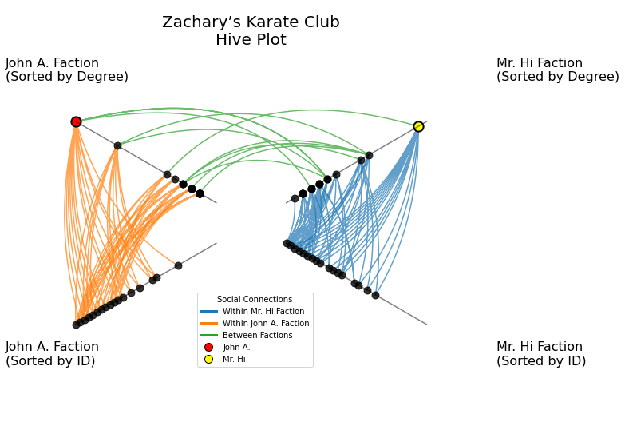
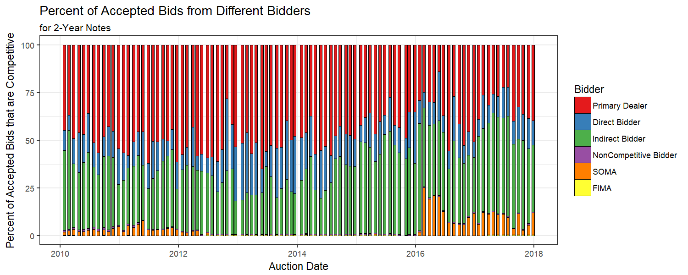

This webpage gives short introductions and links to all of the projects in my portfolio. If you are interested in contributing to a project or if you have questions / suggestions about a project please reach out to me on [LinkedIn](https://www.linkedin.com/in/garykoplik/).

# Hiveplotlib
## Fall, 2020

Introducing hiveplotlib— a new, open-source Python package for generating Hive Plots. Originally developed by Martin Krzywinski, Hive Plots generate well-defined figures that allow for interpretable, visual explorations of network data. The hiveplotlib repository is visible to all on [Gitlab](https://gitlab.com/geomdata/hiveplotlib), with [documentation](https://geomdata.gitlab.io/hiveplotlib/index.html) including further explanation of Hive Plots, examples (both toy data and real data), and full documentation of the code. See [my publication on Towards Data Science](https://towardsdatascience.com/introducing-hiveplotlib-31014cefc7ac) for more.

# A Non-Mathy Introduction to Persistent Homology
## Fall, 2019

Working at Geometric Data Analytics, a company full of Topologists, I have routinely needed to write and interpret tools from Topological Data Analysis (TDA). TDA lives in the world of algebraic topology, a blending of Abstract Algebra and Topology concepts from mathematics. Abstract Algebra was never my strong suit, nor have I ever taken a formal topology class, so I created the following non-mathy explanations and examples for one of the tools that I frequently use, persistent homology. See [my publication on Towards Data Science](https://towardsdatascience.com/persistent-homology-with-examples-1974d4b9c3d0) for more.

<iframe width="600" height="350" src=segmentation_lowerstar_widget.html></iframe>

# Downloading and Parsing U.S. Treasury Auctions Data
## Spring, 2018

I wrote a batch file to run Python and R code that downloads and parses U.S. Treasury auctions data. The resulting datasets offer more detail than other freely available resources. I walk through the implementation of the code and then demonstrate some of the richness of the data through a brief exploratory data analysis using 2-year note auctions. See
[https://gjkoplik.github.io/get_treasury_data/](https://gjkoplik.github.io/get_treasury_data/) for more.

# Normalized Cross Correlation
## Winter, 2018

I go through the math and implementation of Normalized Cross Correlation for object detection with a toy example. See 
[https://gjkoplik.github.io/normalized_cross_correlation/](https://gjkoplik.github.io/normalized_cross_correlation/) for more.

# Spectral Clustering
## Fall, 2017

I go through the theory of K-means and Spectral Clustering and include examples of their varying performance. See
[https://gjkoplik.github.io/spectral_clustering/](https://gjkoplik.github.io/spectral_clustering/) for more.

{width=100%}

# Interactive Index of Well-Being
## Summer, 2017

I created a county-level Index of Well-Being using data on obesity, poverty, unemployment, and high-school graduation rates. See [https://gjkoplik.github.io/Index-of-Well-Being/](https://gjkoplik.github.io/Index-of-Well-Being/) for more. This interactive map assigns equal weights to each of these four variables, but I allow the user to change the weights on these variables with [this R Shiny app](https://gary-koplik.shinyapps.io/index_of_well_being_shiny/).

<iframe width="800" height="600" src=index_well_being_map.html></iframe>

 

 

 

$_\blacksquare$

