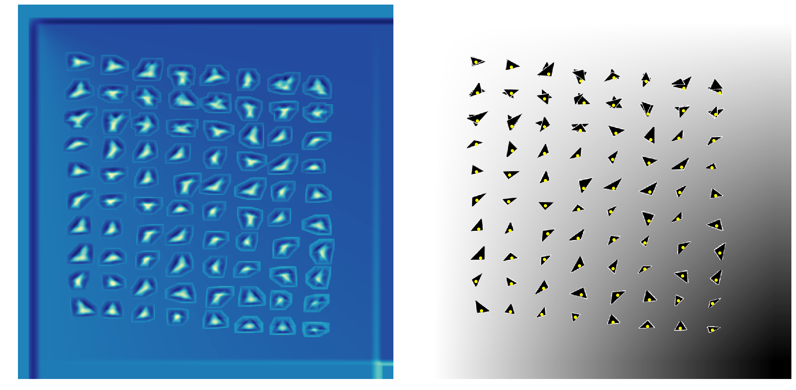
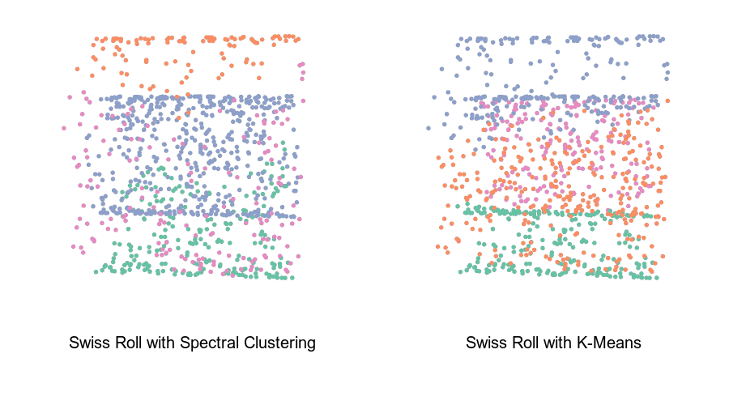

This webpage gives short introductions and links to all of the projects in my portfolio. If you are interested in contributing to a project or if you have questions / suggestions about a project please reach out to me on [LinkedIn](https://www.linkedin.com/in/garykoplik/).

# Normalized Cross Correlation
## Winter, 2018

I go through the math and implementation of Normalized Cross Correlation for object detection with a toy example. See 
[https://gjkoplik.github.io/normalized_cross_correlation/](https://gjkoplik.github.io/normalized_cross_correlation/) for more.



# Spectral Clustering
## Fall, 2017

I go through the theory of K-means and Spectral Clustering and include examples of their varying performance. See
[https://gjkoplik.github.io/spectral_clustering/](https://gjkoplik.github.io/spectral_clustering/) for more.

{width=100%}

# Interactive Index of Well-Being
## Summer, 2017

I created a county-level Index of Well-Being using data on obesity, poverty, unemployment, and high-school graduation rates. See [https://gjkoplik.github.io/Index-of-Well-Being/](https://gjkoplik.github.io/Index-of-Well-Being/) for more. This interactive map assigns equal weights to each of these four variables, but I allow the user to change the weights on these variables with [this R Shiny app](https://gary-koplik.shinyapps.io/index_of_well_being_shiny/).

```{r, echo = F, fig.align = 'center', fig.width = 6.5, fig.height = 4, message = F, warning = F, cache = T}

library(shiny)
library(shinyBS)
library(leaflet)
library(dplyr)
library(albersusa)
library(sp)
library(htmlwidgets)

# load plot data
load("./data_for_index_map/toplot.Rdata")

# load county data

temp <- counties_composite()

# keeping temp as a reference because the simplification is slow
#   if starting from scratch later
county <- temp

# join in the data into the counties shapefile

# need the 01 values to turn to 1 to match csv data
#   and match as a factor
county$fips <- as.factor(as.numeric(county$fips))

# join in the toplot data
county@data <- left_join(county@data, toplot,
                         by = c("fips" = "USEFUL_FIPS"))

# set colorpalette
qpal <- colorBin(
  palette = "RdBu",
  domain = county@data[["Total.Index.Value"]],
  bins = c(1, 2, 3, 4, 5, 6),
  reverse = T)

# for changing the projection
epsg2163 <- leafletCRS(
  crsClass = "L.Proj.CRS",
  code = "EPSG:2163",
  # Lambert Azimuth Equal Area projection
  proj4def = "+proj=laea +lat_0=45 +lon_0=-100 +x_0=0 +y_0=0 +a=6370997 +b=6370997 +units=m +no_defs",
  resolutions = 2^(16:7))


# popup label for each county
# <strong> bolds text and <br/> goes to the next line
popup <- paste0("<strong>", county@data$name, " County", "</strong>",
                "<br/> Index Value: ",
                  county@data[["Total.Index.Value"]],
                "<br/> Obesity: ",
                  county@data[["Obesity"]], "%",
                "<br/> Percent With No High School Diploma: ",
                  county@data[["Percent_Less_Than_High_School"]], "%",
                "<br/> Poverty: ",
                  county@data[["Poverty.Percent..All.Ages"]], "%",
                "<br/> Unemployment: ",
                county@data[["Unemployment.Rate"]], "%"
                )

# make the map
map <- leaflet(county,
               options = leafletOptions(crs = epsg2163, minZoom = 2.6)) %>%
  # add polygons of color
  addPolygons(stroke = T,
              fillOpacity = 1, color = "black", opacity = 1,
              fillColor = ~qpal(county@data[["Total.Index.Value"]]),
              weight = 0.5,
              popup = popup,
              # popupOptions = popupOptions(),
              highlightOptions = highlightOptions(color = "white",
                                                  weight = 2,
                                                  bringToFront = TRUE)) %>%
  # add legend
  #   the function in here is a result of the numbers not
  #     representing the actual cut points
  # see https://github.com/rstudio/leaflet/issues/211
  addLegend(pal = qpal,
            values = county@data[["Total.Index.Value"]],
            labFormat = function(type, cuts, p) {
              n = length(cuts)
              cuts = round(cuts, digits = 2)
              paste0(cuts[-n], " &ndash; ", cuts[-1])
            },
            title = "Index Value",
            opacity = 1) %>%
  # specify starting viewpoint
  setView(lng = -91, lat = 37.5, zoom = 2.6)


map

```

<br>

<br>

<br>

$_\blacksquare$


